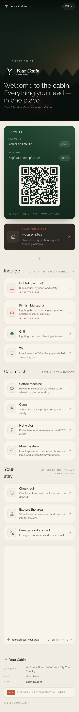
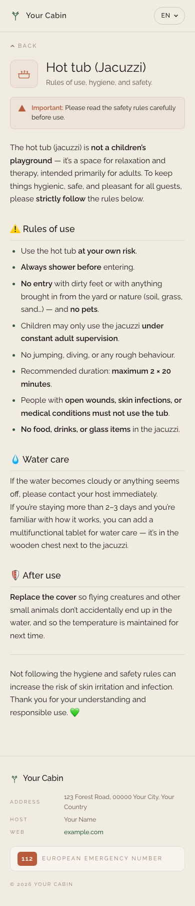
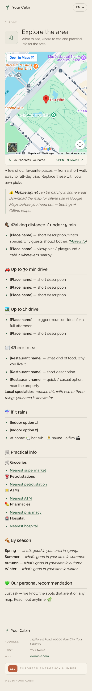
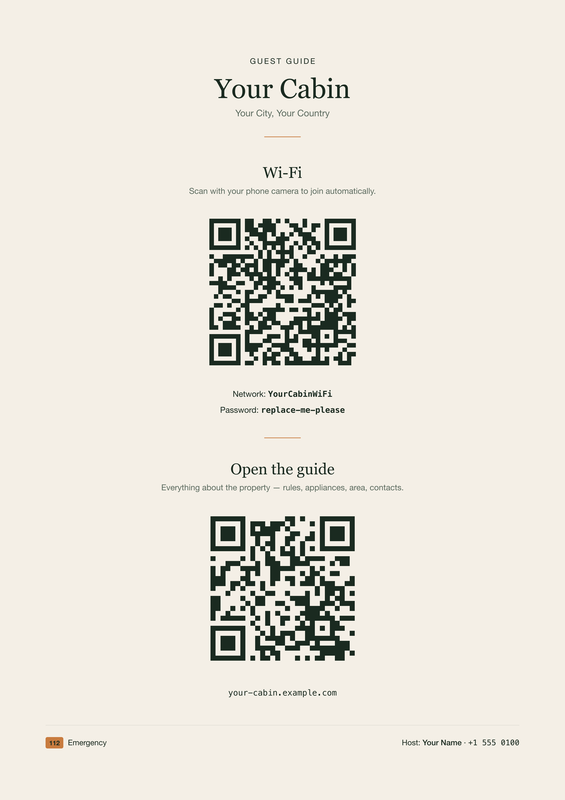

# Guest Guide

A multilingual, offline-capable, brand-customizable **guest information PWA** for vacation rentals — cabins, villas, apartments, anything you let guests stay in.

A free, open-source alternative to **[InfoSpot](https://www.infospot.online/)**, **TouchStay**, and other "guest info" SaaS tools. Built on **Astro 5 + Tailwind 4** — fast, owned by you, no monthly fee. Mobile-first, sub-200kb first load, full offline support after the first visit.

[](https://guest-guide.vercel.app)

[](https://vercel.com/new/clone?repository-url=https%3A%2F%2Fgithub.com%2Fsimonseifert%2Fguest-guide)

---

## Features

- 📱 **Mobile-first** — designed at 390px, scales clean to desktop
- 🌍 **Multilingual** — ships with EN/DE/HR/IT; add any language with one DeepL command
- 🛜 **PWA + offline** — service worker precaches the whole site so guests with patchy signal can still read instructions
- 🪪 **Wi-Fi tap-to-join QR** — guests scan with their camera, phone joins automatically (`WIFI:` URI scheme)
- 🗺️ **Embedded interactive map** for nearby places + open-in-Maps deeplink
- ☎️ **Tap-to-call** emergency + host contact numbers
- 🎨 **Brand-customizable** — single config file (`src/config/property.ts`) controls all property-specific data
- 🔒 **`noindex` by default** — guest info, not search-traffic content
- 🆓 **No SaaS fees** — host it on Vercel / Netlify / Cloudflare Pages free tier
- 🖨️ **Printable A4 poster** — `npm run poster` generates a fridge-ready PNG with Wi-Fi QR + guide QR
- 📰 **Print-friendly stylesheet** — guests can print any section as clean monochrome A4

## Screenshots

<table>
  <tr valign="top">
    <td align="center" width="33%"><sub><b>Home</b><br/>Wi-Fi QR, house rules, sections grouped by category</sub></td>
    <td align="center" width="33%"><sub><b>Section page</b><br/>Safety callouts, prose styled for readability</sub></td>
    <td align="center" width="33%"><sub><b>Explore the area</b><br/>Embedded map + place lists</sub></td>
  </tr>
  <tr valign="top">
    <td></td>
    <td></td>
    <td></td>
  </tr>
</table>

## Why this exists

InfoSpot, TouchStay, and similar tools want £15–£60/month per property for what is, fundamentally, a static webpage with QR codes. This template gives you the same thing in 200 KB of static HTML, deployable for free, owned by you, and customizable down to the last pixel.

| | InfoSpot / TouchStay | Guest Guide |
|---|---|---|
| Monthly cost | £15–£60 / property | $0 |
| Custom domain | Paid tier | Yes |
| Offline support | Limited | Full PWA |
| Multilingual | Paid tier | Yes, 4 languages |
| Custom design | Templates only | Full HTML/CSS control |
| Data ownership | Their servers | Your repo |

## Quick start

```bash
git clone https://github.com/simonseifert/guest-guide.git my-guest-guide
cd my-guest-guide
npm install
npm run dev          # open http://localhost:4321
```

## Customize for your property — 4 steps

### 1. Edit `src/config/property.ts`

Single source of truth for everything property-specific: name, address, host names + phone numbers, Wi-Fi SSID + password, map URLs, languages.

```ts
export const PROPERTY = {
  brand: { name: 'My Cabin', shortName: 'My Cabin', logoSrc: '/logo.svg', tagline: 'Guest guide' },
  address: { line1: '...', city: '...', postcode: '...', country: '...' },
  taxId: null,            // local tax/business ID — set to null to hide
  hosts: [
    { role: 'host', name: 'Your Name', phone: '+1 555 0100' },
    { role: 'helper', name: 'Local Helper', phone: '+1 555 0101' },
  ],
  wifi: { ssid: 'MyCabinWiFi', password: 'replace-me-please', encryption: 'WPA' },
  hero: { photoSrc: '/images/hero-placeholder.svg', photoAlt: 'A cabin at twilight' },
  map: { embedUrl: '...', shareUrl: '...', placeLabel: 'Address · Area' },
  languages: ['en', 'de', 'hr', 'it'],
  defaultLanguage: 'en',
  noindex: true,
  siteUrl: 'https://your-property.example.com',
};
```

### 2. Replace assets in `/public/`

| File | Replace with |
|---|---|
| `logo.svg` | Your wordmark (white-on-transparent, ~612×120 viewBox works best for the dark hero overlay) |
| `images/hero-placeholder.svg` | Your hero photo — JPG/WebP at ~1920×1280 atmospheric. Update `hero.photoSrc` in `property.ts` accordingly. |
| `icon-192.png`, `icon-512.png`, `icon-maskable.png`, `apple-touch-icon.png`, `icon.svg` | Regenerate via `node scripts/generate-icons.mjs` (edit colors at the top of the script first) |
| `favicon.svg` | Your favicon |

### 3. Edit content in `src/content/sections/<lang>/`

Each markdown file is one section page. Frontmatter:

```md
---
title: Section title
icon: 💦                         # emoji shown on the section page header
order: 1                         # sort order within its category
category: indulge                # rules | indulge | tech | stay
summary: One-line description shown on the homepage card.
safetyCritical: true             # adds a safety callout banner
---

Markdown body…
```

The four categories control how sections group on the homepage:

- **`rules`** — featured prominently above the categories (typically house rules)
- **`indulge`** — the fun stuff (jacuzzi, sauna, BBQ, TV)
- **`tech`** — appliances + how-to (coffee, oven, water heater, audio system)
- **`stay`** — practical (check-out, area, emergency contacts)

The starter content is brand-neutral placeholder text. Read it, edit it, replace it. The category labels and homepage section eyebrows live in `src/i18n/ui.ts`.

### 4. Deploy

```bash
npm run build              # → ./dist/
```

Anywhere static-hosted will do. Recommended: **Vercel** — push to GitHub, click "Import" in Vercel dashboard, done. No env vars needed.

## Architecture

```
src/
  config/property.ts                ← edit me first
  content/sections/{en,de,hr,it}/*.md
  components/
    Hero, WifiCard, RulesFeature, AntlerDivider,
    SectionGroup, SectionRow, MapPreview, Icon
  layouts/Layout.astro              ← header + footer + html shell
  pages/
    index.astro                     ← / → language-detected redirect
    [lang]/index.astro              ← /en, /de, /hr, /it (homepages)
    [lang]/[slug].astro             ← per-section pages
  i18n/ui.ts                        ← UI strings + per-language labels
  styles/global.css                 ← design system tokens + component CSS
public/
  logo.svg                          ← your wordmark
  favicon.svg, icon-*.png, apple-touch-icon.png
  images/hero-placeholder.svg       ← swap for your hero photo
  manifest.webmanifest              ← (auto-generated at build)
scripts/
  generate-icons.mjs                ← regenerates PWA icons from a source SVG
  generate-poster.mjs               ← writes dist/poster.png — fridge-ready Wi-Fi + guide QR
  translate.mjs                     ← translate EN markdown into another language
```

## Stack

- [Astro 5](https://astro.build) (static export)
- [Tailwind 4](https://tailwindcss.com) via the Vite plugin
- TypeScript strict
- [@vite-pwa/astro](https://vite-pwa-org.netlify.app/frameworks/astro.html) for service worker + manifest generation (Workbox under the hood)
- [qrcode](https://github.com/soldair/node-qrcode) for build-time Wi-Fi QR generation
- [rehype-external-links](https://github.com/rehypejs/rehype-external-links) so external markdown links open in new tabs

## Print a backup poster

When a guest's phone dies (or they just prefer paper), you want them to be able to walk to the fridge and find the Wi-Fi password and your phone number.

```bash
npm run poster
# → dist/poster.png  (A4 at 300 DPI, ~1.4 MB)
```

Two QR codes — one to join the Wi-Fi automatically, one to open the digital guide — plus the property name, Wi-Fi credentials in plain text, the host phone, and the European emergency number. All pulled from `src/config/property.ts`. Print at A4 with no scaling.

<p align="center">
  
</p>

The site itself also has a print stylesheet — guests can print any section page (rules, hot tub instructions, check-out) as clean monochrome A4. The web chrome (header, language switcher, footer, embedded maps) is hidden automatically.

## Adding or removing languages

Ships with EN/DE/HR/IT. Adding a new language is one command + a two-line edit.

### Auto-translate with DeepL (or OpenAI / Anthropic / Google)

```bash
# 1. Generate translated markdown for the target language (e.g. Spanish):
DEEPL_API_KEY=xxx npm run translate -- es

# Or pick a different provider:
OPENAI_API_KEY=xxx    npm run translate -- es --provider openai
ANTHROPIC_API_KEY=xxx npm run translate -- es --provider anthropic
GOOGLE_TRANSLATE_API_KEY=xxx npm run translate -- es --provider google
```

DeepL's [free tier](https://www.deepl.com/pro#developer) gives you 500k characters/month — more than enough for the ~30 KB of guidebook text. Get your free API key, set it as an env var, run the command. Translation takes about 30 seconds for all 13 sections.

The script preserves frontmatter (only `title` and `summary` are translated), markdown structure, links, code blocks, emoji, and `[bracketed placeholders]`. Pass `--force` to overwrite existing translations.

### Wire the language up

After translating, two more edits to make the language appear in the UI:

```ts
// src/i18n/ui.ts
export const languages = {
  en: 'English',
  de: 'Deutsch',
  hr: 'Hrvatski',
  it: 'Italiano',
  es: 'Español',   // ← add this
} as const;
```

```ts
// src/config/property.ts
languages: ['en', 'de', 'hr', 'it', 'es'],   // ← add 'es'
```

UI strings (nav labels, "Read more", category headings) automatically fall back to English for any language that doesn't have its own dictionary in `src/i18n/ui.ts`. To get fully native-language UI, copy the `en` block in `ui` and translate the values — about 30 strings.

### Supported language codes

The translate script accepts any ISO 2-letter code your provider supports. DeepL covers ~30 languages; OpenAI/Anthropic cover ~100. Common picks for vacation rentals: `es` (Spanish), `fr` (French), `nl` (Dutch), `pl` (Polish), `cs` (Czech), `sk` (Slovak), `sl` (Slovenian), `hu` (Hungarian), `pt` (Portuguese), `ja` (Japanese), `zh` (Chinese).

### Removing a language

Drop it from `PROPERTY.languages`, delete `src/content/sections/<lang>/`, and remove its entry from `src/i18n/ui.ts`. That's it.

> **Always do a human pass.** Machine translation gets you 90% of the way there. The other 10% — tone, idiom, local quirks like "OIB" vs "Tax ID" — still benefits from a native speaker reading through once.

## License

MIT — do whatever you want, no warranty.
